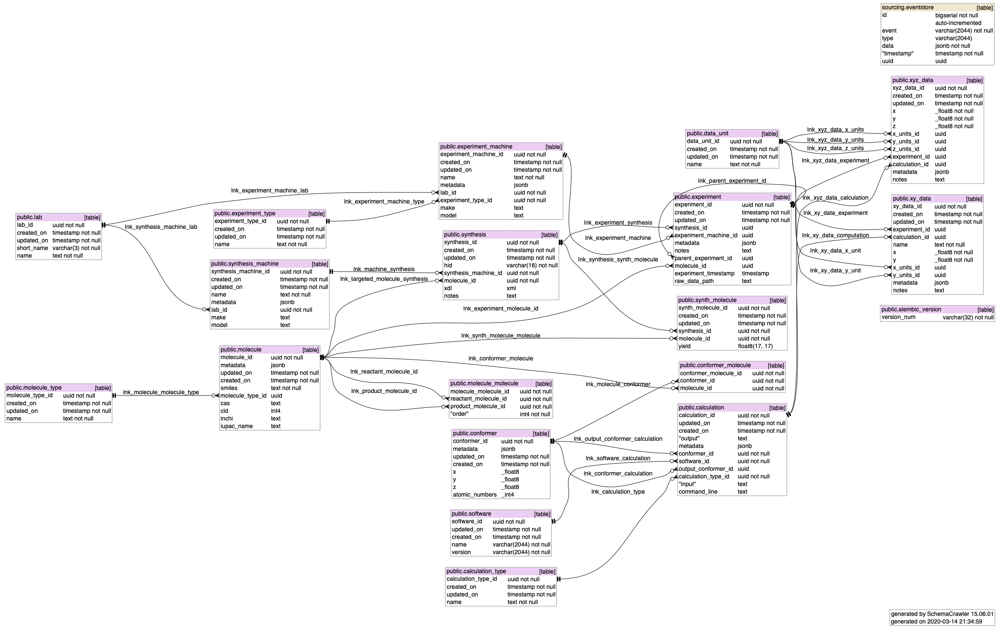

Schema
======

The structure of the database is presented here-below. The tables can be placed in five groups:
    1. base tables related to molecules and materials listing (public.molecule, public.molecule_type, public.molecule_molecule),
    2. tables related to experimental data (public.lab, public.experiment, public.experiment_type, public.experiment_machine, public.synthesis, public.synthesis_machine),
    3. tbles related to the calculations (public.calculation, public.calculation_type, publiuc.conformer, public.conformer_molecule, plublic.software),
    4. tables related to the processed results for both experimental and computational data (public.data_unit, public.xy_data, public.xyz_data),
    5. finally, tables related to the database internals (sourcing.eventstore, public.alembic_version)

All tables contains `created_on` and `updated_on` timestamp of the creation for bookkeeping that are automatically updated. A lot of table contains a field ``metadata`` which can contain a json. This field is meant to be used at the user's convenience, hence virtually adding column that are not in the database without changing a single line of code. One has to be careful to use good naming conventions when using these fields.

Base tables
^^^^^^^^^^^^

**public.molecule_type**

This tables hold the different types of molecule (purchasable fragments, endproduct, etc)

 * ``molecule_type_id`` UUID 
 * ``created_on`` timestamp of the creation 
 * ``updated_on`` timestamp of the last update
 * ``name`` name of the type

**public.molecule**

This table holds data about the molecules. Some fields are completed automatically when using the client.

 * ``molecule_id`` UUID 
 * ``created_on`` timestamp of the creation 
 * ``updated_on`` timestamp of the last update
 * ``metadata`` json field to be used at the user's convenience
 * ``smiles`` smiles of the molecule
 * ``molecule_type_id`` UUID of the molecule type the molecule belongs
 * ``cas`` CAS number (autocompleted)
 * ``cid`` CID number (autocompleted)
 * ``inchi`` inchi of the molecule (autocompleted)
 * ``iupac_name`` IUPAC name of the molecule (autocompleted)

**public.molecule_molecule**

This table holds the relationship between the molecules. For instance, if a molecule (product) has been made from other molecules (reactants).

 * ``molecule_molecule_id`` UUID 
 * ``created_on`` timestamp of the creation 
 * ``updated_on`` timestamp of the last update
 * ``order`` numerical order in which the reactants have been added.

Table for experimental data
^^^^^^^^^^^^^^^^^^^^^^^^^^^

**public.lab**

This table holds the data regarding the different labs/teams participating in the experimental effort.

 * ``lab_id`` UUID  of the entry
 * ``created_on`` timestamp of the creation
 * ``updated_on`` timestamp of the last update
 * ``short_name`` 3 characters as a short name of the lab
 * ``name`` name of the lab

**public.experiment_type**

This table holds the data relative to the type of experiment (like NMR, UV/vis, etc)

 * ``experiment_type_id`` UUID 
 * ``created_on`` timestamp of the creation 
 * ``updated_on`` timestamp of the last update
 * ``name`` name of the type of experiment

**public.experiment_machine**

This table holds the data relative to machines to perform the experiments

 * ``experiment_machine_id`` UUID 
 * ``created_on`` timestamp of the creation 
 * ``updated_on`` timestamp of the last update
 * ``metadata`` json field to be used at the user's convenience
 * ``name`` name of the machine
 * ``make`` make of the machine
 * ``model`` model of the machine
 * ``experiment_type_id`` uuid of the experiment type possible to perform with this machine
 * ``lab_id`` uuid of the lab owning the machine

**public.synthesis_machine**

This table holds the data relative to the machine performing synthesis. This table could also list experimental chemist doing the work.

 * ``synthesis_machine_id`` UUID 
 * ``created_on`` timestamp of the creation 
 * ``updated_on`` timestamp of the last update
 * ``name`` name of the machine
 * ``metadata`` json field to be used at the user's convenience
 * ``lab_id`` UUID of the lab where the machine is located
 * ``make`` make of the machine
 * ``model`` model of the machine

**public.synthesis**

This table holds the data relative to a synthesis or an attempt of a synthesis

 * ``synthesis_id`` UUID 
 * ``created_on`` timestamp of the creation 
 * ``updated_on`` timestamp of the last update
 * ``hid`` human-readable id. Automatically generated following the template `lab.shortname_yyyy_mm_dd_X` where `X` is a number.
 * ``synthesis_machine_id`` UUID of the synthesis machine used
 * ``molecule_id`` UUID of the target molecule (which may differ from the end result)
 * ``xdl`` XDL recipe for the synthesis
 * ``notes`` Eventual notes and observations

**public.synth_molecule**

Relationship between synthesis and obtained molecule. Ideally this would list all of the molecule obtained during a particular synthesis.

 * ``synth_molecule_id`` UUID 
 * ``created_on`` timestamp of the creation 
 * ``updated_on`` timestamp of the last update
 * ``synthesis_id`` UUID of the synthesis
 * ``molecule_id`` UUID of the molecule obtained
 * ``yield`` fraction of the molecule obtained

**public.experiment**

This table contains data related to experiments

 * ``experiment_id`` UUID 
 * ``created_on`` timestamp of the creation 
 * ``updated_on`` timestamp of the last update
 * ``synthesis_id`` UUID of the synthesis used for this experiment (if coming from a synthesis)
 * ``molecule_id`` UUID of the molecule used for this experiment (if coming from somewhere else)
 * ``experimental_machine_id`` UUID of the machine used to perform this experiment
 * ``metadata`` json field to be used at the user's convenience
 * ``notes`` experimental observation
 * ``parent_experiment_id`` UUID of the parent experiment if this experiment is "subpart" of another experiment
 * ``experiment_timestamp`` timestamp when the experiment was performed
 * ``raw_data_path`` path where the data are on the machine.

**public.software**

This table contains the info related to the software used to perform calculations

 * ``software_id`` UUID 
 * ``created_on`` timestamp of the creation 
 * ``updated_on`` timestamp of the last update
 * ``name`` name of the software
 * ``version`` version of the software

**public.calculation_type**

This table holds the data related to the different calculation type

 * ``calculation_type_id`` UUID 
 * ``created_on`` timestamp of the creation 
 * ``updated_on`` timestamp of the last update
 * ``name`` name of the calculation type

**public.calculation**

 * ``calculation_id`` UUID 
 * ``created_on`` timestamp of the creation 
 * ``updated_on`` timestamp of the last update
 * ``output`` text output of the calculation
 * ``metadata`` json field to be used at the user's convenience
 * ``conformer_id`` uuid of the conformer used to start the calculation
 * ``software_id`` uuid of the software used to perform the calculation
 * ``calculation_type_id`` uuid of the calculation type
 * ``output_conformer_id`` uuid of the conformer generated during this calculation (if any)
 * ``command_line`` command line used to start the calculation

**public.conformer**

This tables holds the data relatives to the conformer

 * ``conformer_id`` UUID 
 * ``created_on`` timestamp of the creation 
 * ``updated_on`` timestamp of the last update
 * ``metadata`` json field to be used at the user's convenience
 * ``x`` array containing the x coordinates of the atoms
 * ``y`` array containing the y coordinates of the atoms
 * ``z`` array containing the z coordinates of the atoms
 * ``atomic_numbers`` array containing the atomic numbers of the atoms

**public.conformer_molecule**

This table holds the relationship between molecules and conformers

 * ``conformer_molecule_id`` UUID 
 * ``created_on`` timestamp of the creation 
 * ``updated_on`` timestamp of the last update
 * ``molecule_id`` UUID of the molecule
 * ``conformer_id`` UUID of the conformer

Tables related to processed results
^^^^^^^^^^^^^^^^^^^^^^^^^^^^^^^^^^^

**public.data_unit**

This table contains the different units in use in the data

 * ``data_unit_id`` UUID 
 * ``created_on`` timestamp of the creation 
 * ``updated_on`` timestamp of the last update
 * ``name`` name of the unit

**public.xy_data**

This table is meant to hold 2-dimension experimental data.

 * ``xy_data_id`` UUID 
 * ``created_on`` timestamp of the creation 
 * ``updated_on`` timestamp of the last update
 * ``x`` x-axis data
 * ``y`` y-axis data
 * ``x_units_id`` UUID of the x-axis units
 * ``y_units_id`` UUID of the y-axis units
 * ``metadata`` json field to be used at the user's convenience
 * ``notes`` observation on this data
 * ``experiment_id`` uuid of the experiment the data belongs
 * ``calculation_id`` uuid of the calculation the data belongs

**public.xyz_data**

This table is meant to hold 3-dimension data.

 * ``xyz_data_id`` UUID 
 * ``created_on`` timestamp of the creation 
 * ``updated_on`` timestamp of the last update
 * ``x`` x-axis data
 * ``y`` y-axis data
 * ``z`` z-axis data
 * ``x_units_id`` UUID of the x-axis units
 * ``y_units_id`` UUID of the y-axis units
 * ``z_units_id`` UUID of the z-axis units
 * ``metadata`` json field to be used at the user's convenience
 * ``notes`` observation on this data
 * ``experiment_id`` uuid of the experiment the data belongs
 * ``calculation_id`` uuid of the calculation the data belongs

Tables related to the database itself
^^^^^^^^^^^^^^^^^^^^^^^^^^^^^^^^^^^^^

**public.alembic_version**

This table contains the version of the database structure. It is advised not to change this table unless you know what you are doing.

**sourcing.eventstore**

Table containing all the events that happened in the database.

  * ``id`` row id
  * ``event`` Type of event (create, delete, update, rollback)
  * ``type`` Data type (name of the table where to insert the data
  * ``timestamp`` timestamp of the event
  * ``uuid`` UUID of the object inserted
