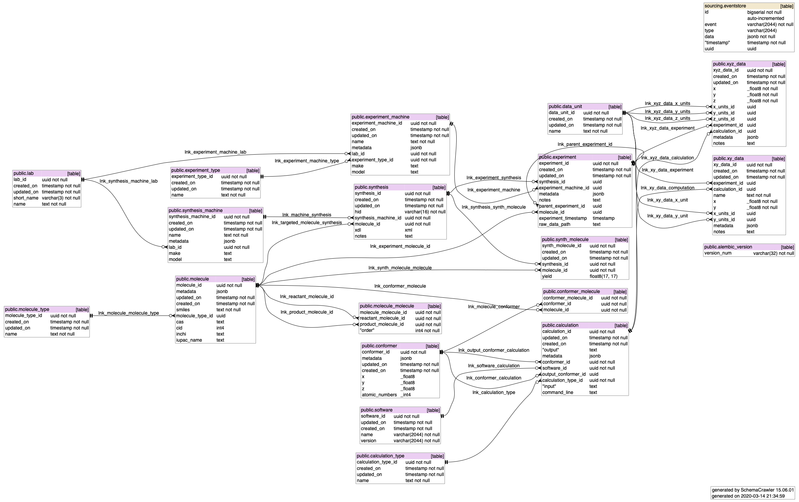

SQL Schema
==========

All the code and material regarding the database can be found in the `pgsql` folder of the source code:

::

    pgsql
    ├── event_sourcing.sql  -- The implementation of the event sourcing
    ├── postgresql.conf     -- A configuration of postgresql that is a bit less minimal than the default one
    ├── setup.sh            -- Shell script to set up the event sourcing and the structure in the database
    └── structure.sql       -- Structure of the database

Updates and migrations can be found in the `migrations` folder. Alembic is used
to manage the migrations.

The current structure looks like this:

